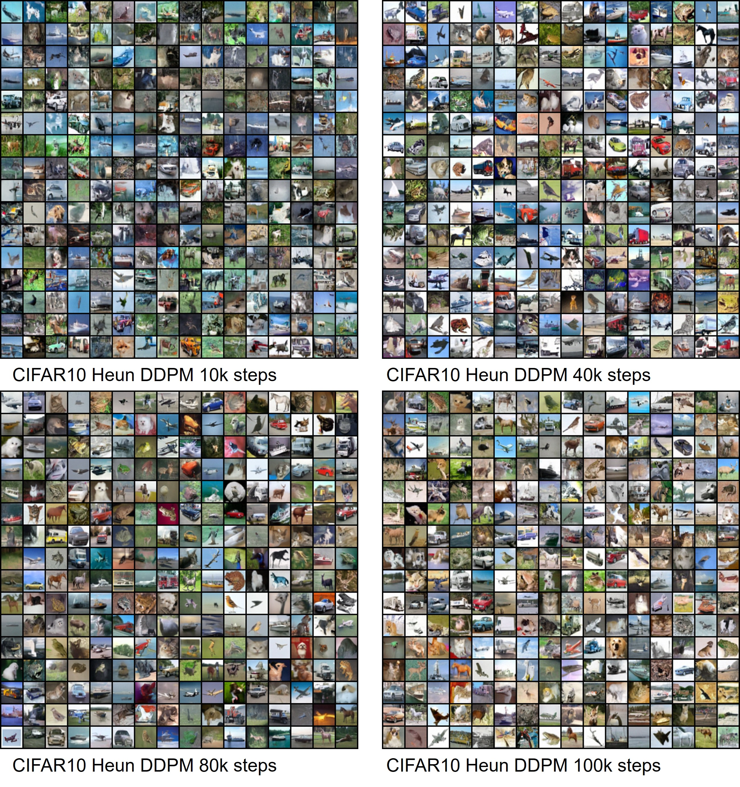

# Results



# DFusion

Easy to use library for various implementtaions of denoising diffusion models

The diffusion trainer and sampler implemented here can handle arbitrary shapes.
For example, it can handle tensors with shape of `(N, C, ...)`, (e.g. `(N, C, 1, 2, 3, 4, 5, 6)`), where `N` is batch size and `C` is channel size).
It will help apply diffusion models in another domain not just images.

It contains:
- [`DDPMTrainer`](./dfusion/dfusion/ddpm_trainer.py), [`DDPMSampler`](./dfusion/dfusion/ddpm_sampler.py): (https://arxiv.org/abs/2006.11239)
- [`DDIMSampler`](./dfusion/dfusion/ddim_sampler.py): (https://arxiv.org/abs/2010.02502)
- [`HeunSampler`](./dfusion/dfusion/karras_sampler.py): (https://arxiv.org/abs/2206.00364)


Currently working on:

- [x] Include DDPM Trainer and Sampler
- [x] Include DDIM Sampler
- [x] Include Elucidating Diffusion
- [ ] Include D3PM
- [x] Test on CIFAR10 dataset
- [ ] Show CIFAR10 test results
- [ ] Make example how to use (currently no examples here, but you can see [here](./cifar10_ddpm_unconditional.py))
- [ ] Make example of unconditional generation
- [ ] Make example of conditional generation (can be done by modifying `denoise_fn` parameter with other callable function (e.g. python `lambda`) of trainer and sampler)
- [ ] Make example of classifier-free guidance generation


# Installation

```sh
pip install dfusion
```


# Acknowledgement

I borrwed source codes largely from the following repositories.
Many codes are mixtured and done refactoring.
- https://github.com/w86763777/pytorch-ddpm
- https://github.com/lucidrains/denoising-diffusion-pytorch
- https://github.com/google-research/google-research
- https://github.com/openai/point-e
- https://github.com/CompVis/latent-diffusion
